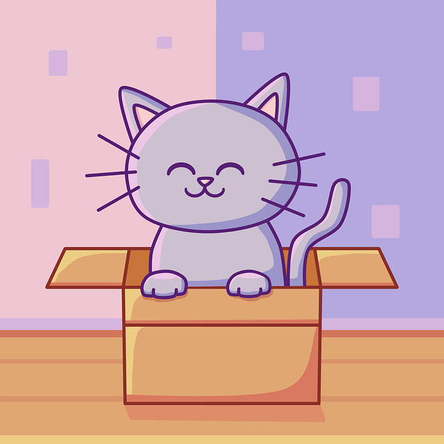
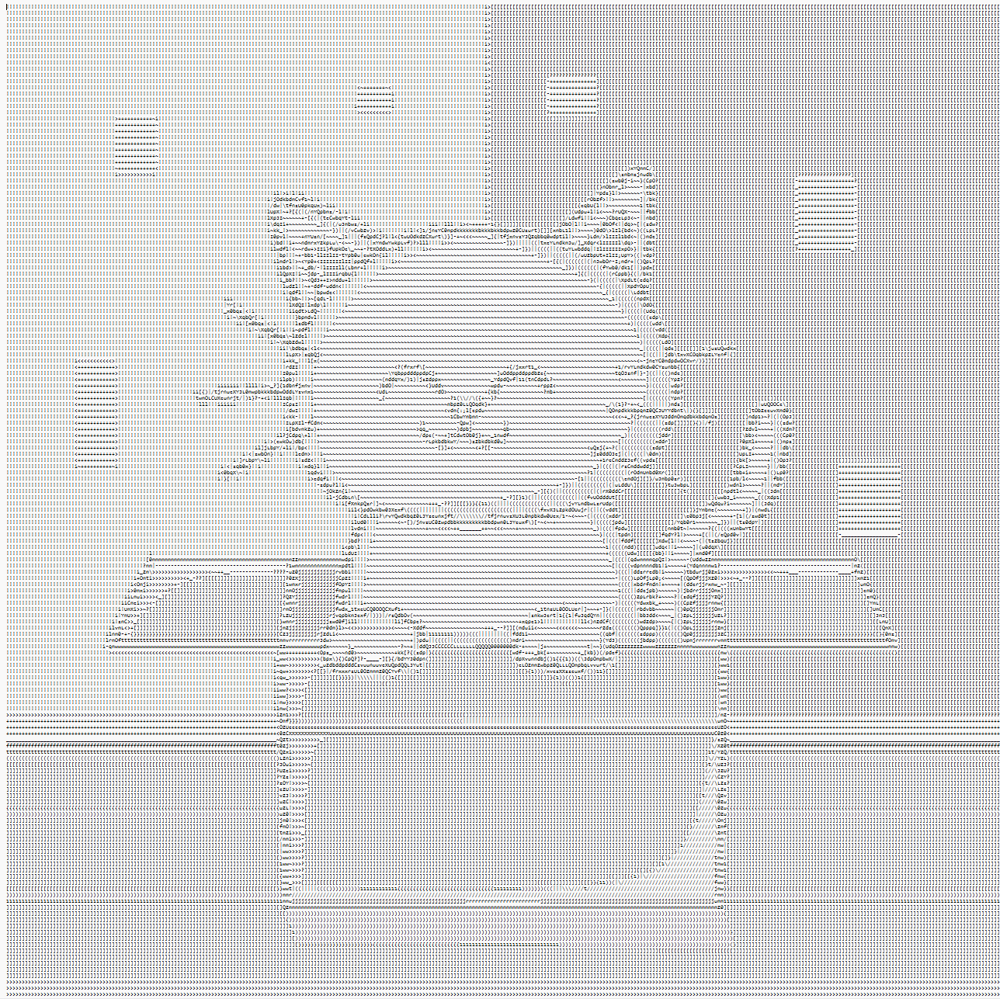
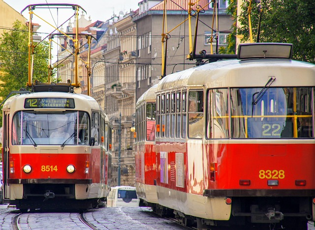
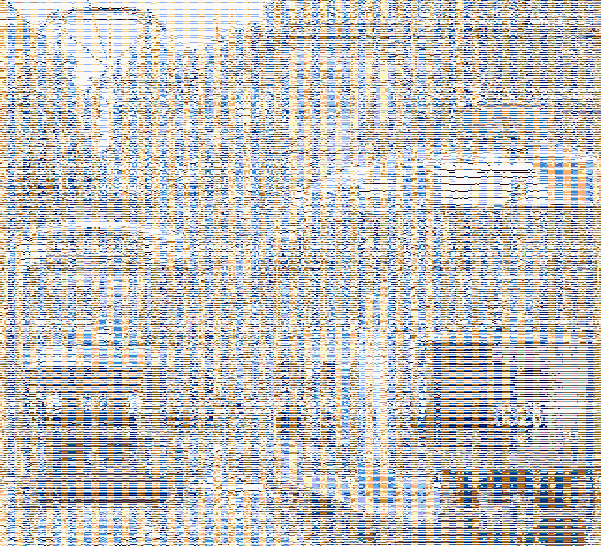

# ASCII Art Converter


A Scala command-line application that converts images into ASCII art.

Built as a semester assignment for the **BI-OOP – Object-Oriented Programming** course at the
Faculty of Information Technology, Czech Technical University in Prague. The project emphasises
clean object-oriented design, composable image-processing pipelines, and unit-tested core logic.

---

## Overview

ASCII Art Converter turns a raster image into text art through a configurable pipeline:

```txt
load image  →  apply filters  →  convert to ASCII  →  export (console / file)
```

Every stage is an interchangeable component, so inputs, filters, shading tables, and outputs can be
mixed freely in a single command. Multiple filters and multiple outputs can be combined in one run.

---

## Key Features

### Image Input
Load pixels from disk or generate them on the fly.

- Load an image from a file
- Generate a random image (no input file required)

### ASCII Conversion
Translate pixel brightness into characters using linear or non-linear shading tables.

- Predefined shading tables (Paul Bourke, Short Paul Bourke, Block)
- Custom character ramps supplied directly on the command line
- Non-linear tables loaded from a file with explicit brightness ranges

### Image Filters
Transform the image before conversion. Filters are optional and freely combinable.

- Rotate, scale, and flip
- Invert colors
- Adjust brightness
- Correct character aspect ratio

### Output
Send the result wherever you need it — or to several places at once.

- Print to the console
- Save to a file
- Combine multiple outputs in a single command

---

## Technology Stack

- **Scala 2.13**
- **sbt** (build tool)
- **ScalaTest** (unit testing)
- **Mockito-Scala** (mocking)
- **JVM / JDK**

---

## Architecture

The codebase is organised around single-responsibility components that plug into a shared pipeline.

### Design Principles
- **Composition over inheritance** — filters, exporters, and convertors are small, focused classes
- **Null-object pattern** — `EmptyFilter`, `EmptyImageLoader`, `EmptyImageExporter` provide safe no-op defaults
- **Composite pattern** — `MultiFilter` and `MultiImageExporter` chain several behaviours behind one interface
- **Strategy pattern** — each shading table (`SequenceASCIIConvertor`, `RangeASCIIConvertor`, …) is an interchangeable conversion strategy
- **Separation of concerns** — I/O, image models, and UI (command parsing / controller / view) live in distinct layers

### Conversion Model
Brightness is computed with the standard luminance weighting
(`0.30·R + 0.59·G + 0.11·B`) and mapped to a character via the selected shading table —
either a linear character sequence or a set of explicit brightness ranges.

---

## Getting Started

### Prerequisites

Make sure the following are installed:

- **Java / JDK**
- **sbt**

### Running the Application

From the project root, launch the interactive sbt shell:

```bash
sbt
```

Then run the application:

```bash
run --image [pathToFile] [options...]
```

Example:

```bash
run --image "images/testImage1.png" --rotate 90 --scale 0.25 --invert --output-console
```

You can also run it directly from the terminal:

```bash
sbt "run --image images/testImage1.png --rotate 90 --scale 0.25 --invert --output-console"
```

---

## Command-Line Options

The order of commands does not matter.

### Image Input

Choose exactly one:

| Option | Description |
| --- | --- |
| `--image [pathToFile]` | Loads an image from a file |
| `--image-random` | Generates a random image |

### Output

Choose at least one:

| Option | Description |
| --- | --- |
| `--output-file [pathToFile]` | Saves the ASCII output to a file |
| `--output-console` | Prints the ASCII output to the console |

### ASCII Shading

Choose at most one. If no shading option is provided, the default table is used.

| Option | Description |
| --- | --- |
| `--table [tableName]` | Uses a predefined shading table |
| `--custom-table [characters]` | Uses a custom character sequence as a shading table |
| `--nonlinear-table [pathToFile]` | Loads a non-linear shading table from a file |

Predefined character ramps (dark → light):

| Table | Characters |
| --- | --- |
| Paul Bourke *(default)* | `` $@B%8&WM#*oahkbdpqwmZO0QLCJUYXzcvunxrjft/\|()1{}[]?-_+~<>i!lI;:,"^`'.  `` |
| Short Paul Bourke | `@%#*+=-:. ` |
| Block | `█▓▒░ ` |

Example with a custom table:

```bash
run --image "images/testImage1.png" --custom-table "@%#*+=-:. " --output-console
```

### Filters

Filters are optional and can be combined.

| Option | Description |
| --- | --- |
| `--rotate [degrees]` | Rotates the image by the given angle |
| `--scale [factor]` | Scales the image, for example `0.5` for half size |
| `--invert` | Inverts image colors |
| `--flip [axis]` | Flips the image along the `x` or `y` axis |
| `--brightness [value]` | Adjusts brightness using a positive or negative value |
| `--fix-ratio` | Adjusts the output for character aspect ratio |

### Help

```bash
run --help
```

---

## Non-Linear Shading Table Format

A non-linear shading table can be loaded from a text file using:

```bash
--nonlinear-table [pathToFile]
```

Each line maps a brightness range (`min..max`) to a single character:

```txt
0..100->X
100..200->I
200..256->O
```

---

## Example

```bash
run --image "images/testImage1.png" --rotate 90 --scale 0.25 --invert --fix-ratio --output-console
```

This command:

- loads an image from `images/testImage1.png`
- rotates it by 90 degrees
- scales it down to 25%
- inverts the colors
- adjusts the character ratio
- prints the ASCII result to the console

---

## Gallery

| Input | ASCII output |
| --- | --- |
|  |  |
|  |  |

Image credits (via [Pixabay](https://pixabay.com)):

- First image by Edurs34 — [source](https://pixabay.com/illustrations/cat-feline-box-kawaii-animal-7928232/)
- Second image by Lakeblog — [source](https://pixabay.com/photos/tram-railroad-city-vehicle-rail-5863228/)

---

## Testing

Core components are covered by unit tests using ScalaTest, with Mockito-Scala for mocking
collaborators.

Run the full test suite from the project root:

```bash
sbt test
```

If you are using an IDE such as IntelliJ IDEA or Rider, tests can also be run from the test tool
window or from the gutter icons next to individual test classes and methods.

---

## Project Structure

```txt
src/main/scala
├── ASCIIConvertor     # Image-to-ASCII conversion logic and shading tables
├── ImageExporters     # Console and file output
├── ImageFilters       # Image transformations
├── ImageLoaders       # File and random image loading
├── Images             # Image and color models
├── IO                 # Input/output abstraction
├── ShaderLoaders      # Custom shading table loading
└── UI                 # Command parsing and console interface
```

---
